# Flutter_App — Aplicativo de prática de partitura com feedback em tempo real

Aplicativo Flutter do TCC **Sistema de Processamento de Áudio com Feedback em Tempo Real Aplicado ao Ensino de Partitura**.

O aluno toca a partitura exibida no app; o [dispositivo embarcado](https://github.com/noggyamamoto/firmware_I2S) (ESP32 + microfone INMP441) identifica as notas tocadas e as envia ao app, que compara cada nota com a partitura **MusicXML** e mostra o resultado na hora: verde para acerto, amarelo para aproximado e vermelho para erro, como nos aplicativos de prática musical (Simply Piano, Yousician, Meludia).

---

## Sumário

1. [Visão geral](#1-visão-geral)
2. [Funcionalidades e requisitos](#2-funcionalidades-e-requisitos)
3. [Plataformas](#3-plataformas)
4. [Arquitetura](#4-arquitetura)
   - 4.1 [Camadas](#41-camadas)
   - 4.2 [Estrutura de diretórios](#42-estrutura-de-diretórios)
   - 4.3 [Módulos](#43-módulos)
   - 4.4 [Diagramas de classes](#44-diagramas-de-classes)
5. [Fluxos de funcionamento](#5-fluxos-de-funcionamento)
6. [Renderização da partitura](#6-renderização-da-partitura)
7. [Interface de execução e feedback](#7-interface-de-execução-e-feedback)
8. [Partituras MusicXML](#8-partituras-musicxml)
9. [Como executar](#9-como-executar)
10. [Testes](#10-testes)
11. [Firestore](#11-firestore)
12. [Créditos e licenças](#12-créditos-e-licenças)

---

## 1. Visão geral

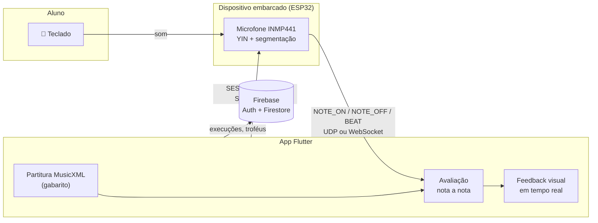

| Item | Descrição |
|---|---|
| Framework | Flutter 3 (Dart 3) |
| Estado | Riverpod 3 (`Notifier`/`Provider`) |
| Backend | Firebase Authentication e Cloud Firestore |
| Partituras | MusicXML (`.musicxml`, `.xml`, `.mxl` compactado) |
| Notação | Motor de gravação próprio com a fonte SMuFL **Bravura** |
| Comunicação | UDP (Android, iOS, desktop) e WebSocket (web) com o protocolo binário do firmware |

---

## 2. Funcionalidades e requisitos

| Requisito (TCC) | Funcionalidade | Onde |
|---|---|---|
| **RFA01** / RU02 – Pareamento | Busca por broadcast (UDP), conexão pelo IP, heartbeat, modo demonstração | `features/connection` |
| **RFA02** / RU03 – Catálogo | Repertório por dificuldade (fácil, médio, difícil) com busca | `features/songs` |
| **RFA03** / RU04–RU06 – Configuração | Música guia, metrônomo sonoro e visual, tamanho dos trechos, ampliação | `features/configuration` |
| **RFA04** / RU08 – Partitura adaptada | Trechos curtos, símbolos ampliados, ajuste à tela | `features/score/presentation/notation` |
| **RFA05** / RU07 – Compassos de entrada | Contagem de 2 compassos sincronizada com o metrônomo do dispositivo | `performance` (`CountdownWidget`) |
| **RFA06** / RU10 – Cores em tempo real | Verde = acerto, amarelo = aproximado, vermelho = erro/nota perdida, com selo sobre a nota | `performance`, `score_painter.dart` |
| **RFA07** – Avaliação por frase | Altura e ritmo calculados ao término de cada trecho | `performance_evaluator.dart` |
| **RFA08** / RU11 – Interrupção < 50 % | Tela de incentivo com "Repetir trecho" | `performance_page.dart` |
| **RFA09** / RU12 – Redução de BPM | Sugestão ou ajuste automático de −10 % | `performance_provider.dart` |
| **RFA10** / RU13 / RU15 – Pontuação e troféus | Precisão, estrelas, conceito (A+ a F) e troféus | `performance_result_page.dart`, `features/gamification` |
| **RFA11** / RU14 – Evolução | Gráfico de linha a partir da 10ª execução da mesma música | `performance_chart.dart` |
| RU16 / RU17 – Reiniciar e desconectar | Tocar novamente e desconexão segura | resultado / conexão |
| **RNFA01** – Portabilidade | Android, iOS, Web, Windows, macOS e Linux com layout responsivo | todo o app |
| **RNFA02** – Comunicação assíncrona | WebSocket na web e UDP nativo, sem bloquear a interface | `connection/data/transport` |

---

## 3. Plataformas

| Plataforma | Comunicação com o dispositivo | Descoberta | Observações |
|---|---|---|---|
| Android / iOS | UDP (porta 54322) | Broadcast ou IP | iOS pede permissão de rede local (`NSLocalNetworkUsageDescription`) |
| Windows / macOS / Linux | UDP (porta 54322) | Broadcast ou IP | — |
| Web (Chrome, Edge, Firefox, Safari) | WebSocket `ws://IP/ws` | IP informado ou `192.168.4.1` (rede própria do dispositivo) | Servir o app por `http://` (páginas `https://` bloqueiam `ws://`) |
| Todas | Modo demonstração | — | Um "aluno virtual" toca a partitura com pequenos erros, sem hardware |

O layout se adapta ao tamanho da tela (ver [seção 7](#7-interface-de-execução-e-feedback)): celular em pé, celular deitado, tablet e navegador/desktop.

---

## 4. Arquitetura

### 4.1 Camadas

Cada funcionalidade (`features/*`) segue a **Clean Architecture** em três camadas, com dependências apontando para o domínio:

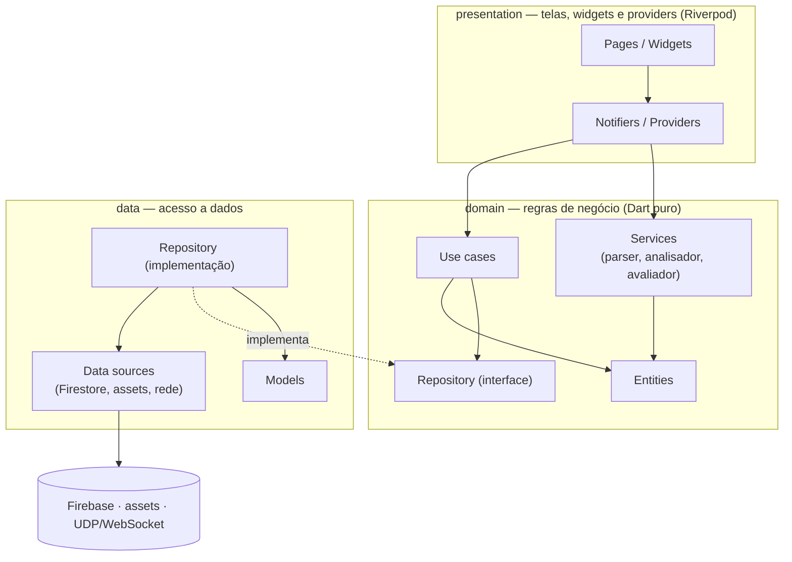

### 4.2 Estrutura de diretórios

```text
flutter_app/
├── assets/
│   ├── fonts/Bravura.otf              # fonte musical SMuFL (OFL)
│   ├── midi/                          # áudio guia (MIDI)
│   └── partituras/                    # partituras MusicXML do repertório
├── lib/
│   ├── main.dart                      # inicialização (Firebase + ProviderScope)
│   ├── core/theme/app_colors.dart     # identidade visual (cores e feedback)
│   └── features/
│       ├── auth/                      # login, cadastro, perfil
│       ├── connection/                # dispositivo: protocolo, transporte UDP/WebSocket, simulador
│       ├── songs/                     # repertório (Firestore)
│       ├── configuration/             # preferências da execução
│       ├── score/                     # partitura: parser MusicXML, frases, avaliação, notação
│       │   └── presentation/notation/ # motor de gravação (SMuFL/Bravura)
│       ├── performance/               # tela de execução, HUD, metrônomo, resultado
│       ├── history/                   # histórico de execuções
│       └── gamification/              # troféus
├── test/                              # testes de unidade, widgets, renderização e integração
├── tools/midi_to_musicxml.py          # conversão de MIDI para MusicXML (music21)
├── web/ android/ ios/ windows/ macos/ linux/
└── pubspec.yaml
```

### 4.3 Módulos

| Módulo | Responsabilidade | Principais classes |
|---|---|---|
| `auth` | Autenticação (Firebase Auth) e perfil | `AuthNotifier`, `AuthGate`, `LoginPage` |
| `connection` | Descoberta, pareamento, heartbeat, eventos do dispositivo, simulador | `ConnectionNotifier`, `ConnectionRepositoryImpl`, `DeviceProtocol`, `UdpTransport` |
| `songs` | Catálogo de músicas por dificuldade | `SongsPage`, `Song` |
| `configuration` | Preferências (música guia, metrônomo, trechos, zoom) | `ConfigurationNotifier`, `PerformanceSettings` |
| `score` | Leitura do MusicXML, frases, melodia avaliada, avaliação e renderização | `MusicXmlParser`, `ScoreAnalyzer`, `PerformanceEvaluator`, `ScoreEngraver` |
| `performance` | Execução em tempo real, HUD, feedback, áudio guia, resultado | `PerformanceNotifier`, `PerformancePage`, `ScoreDisplay` |
| `history` | Execuções salvas e evolução | `HistoryRepository`, `PerformanceChart` |
| `gamification` | Troféus e progresso | `CheckTrophies`, `GamificationPage` |

### 4.4 Diagramas de classes

#### a) Domínio da partitura

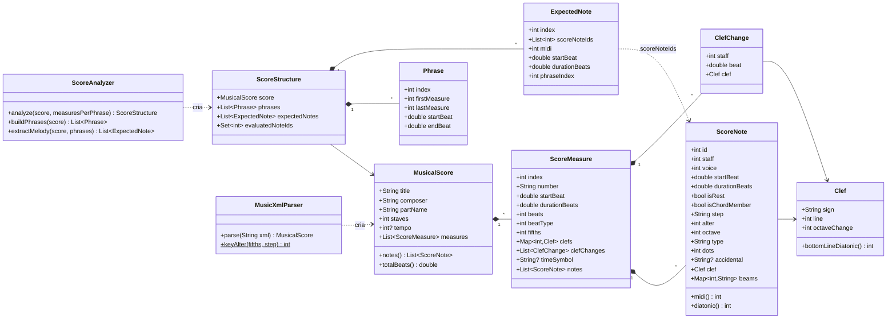

#### b) Renderização da partitura

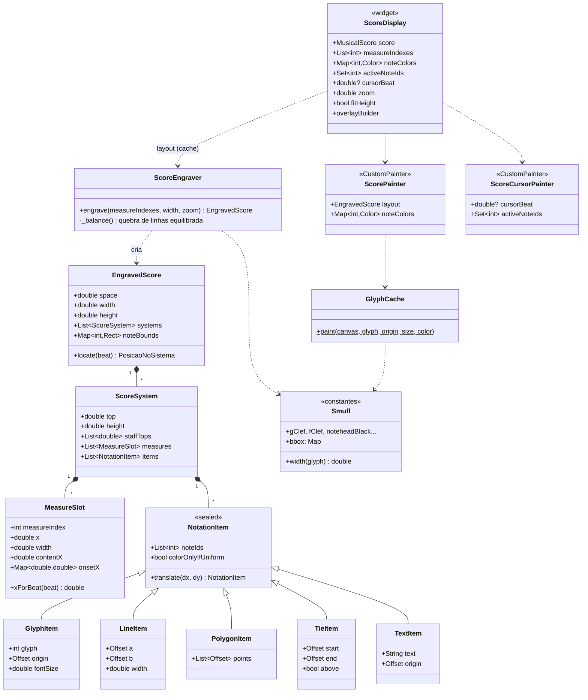

#### c) Execução, avaliação e comunicação

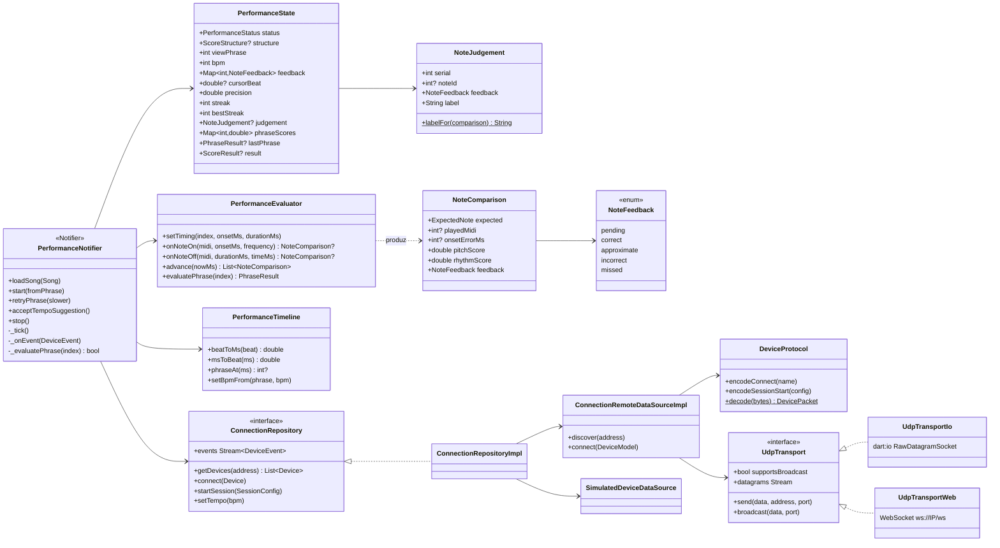

> `UdpTransportIo` e `UdpTransportWeb` correspondem a `udp_transport_io.dart` e `udp_transport_web.dart`, escolhidos por importação condicional (`dart.library.io`).

---

## 5. Fluxos de funcionamento

### 5.1 Navegação

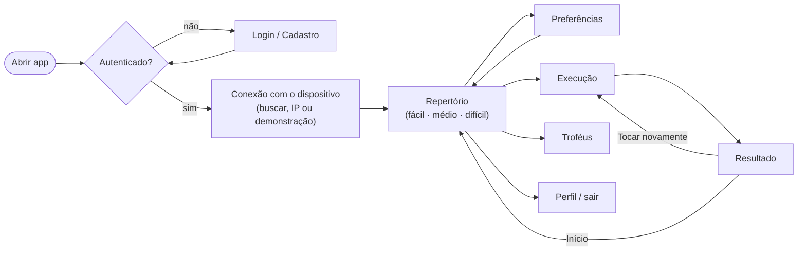

### 5.2 Carregamento da partitura

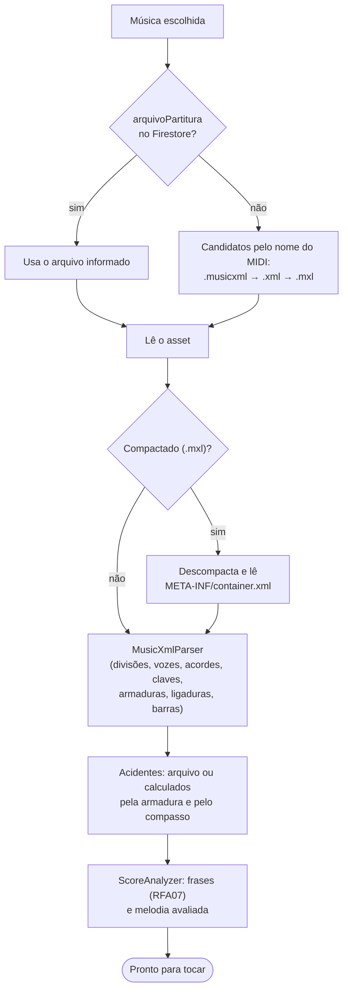

### 5.3 Execução e feedback em tempo real

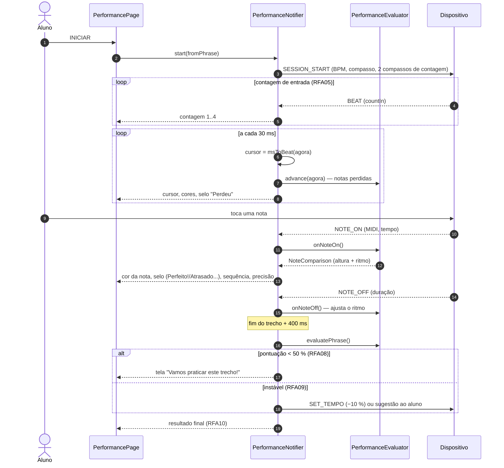

### 5.4 Avaliação de uma nota

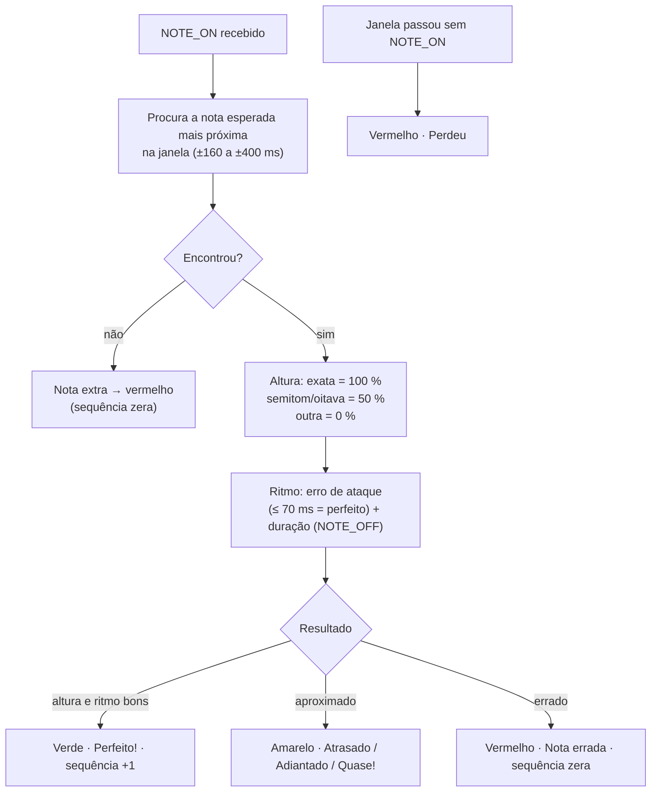

### 5.5 Conexão com o dispositivo

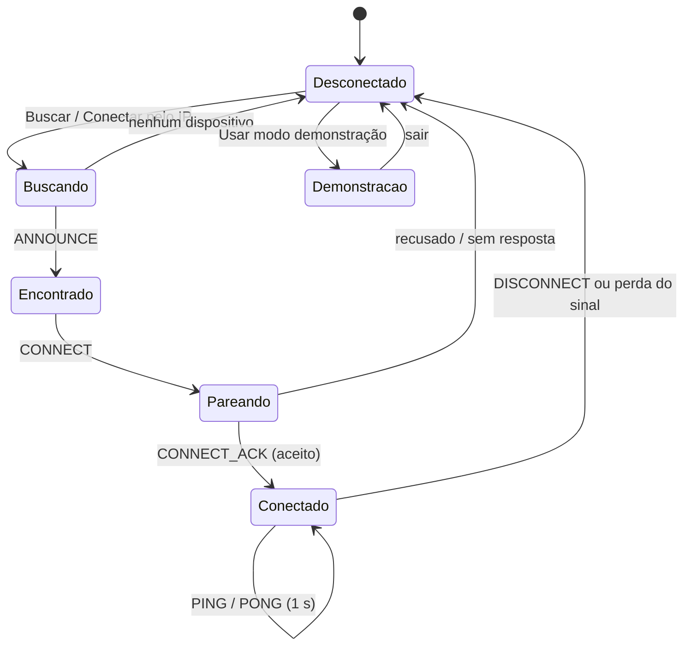

---

## 6. Renderização da partitura

A partitura é desenhada por um **motor de gravação próprio** (`lib/features/score/presentation/notation`), que funciona igualmente no celular, no desktop e na web (CanvasKit), sem WebView.

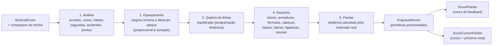

| Aspecto | Como é tratado |
|---|---|
| Símbolos | Fonte **SMuFL Bravura**: cada glifo é posicionado pela sua origem na linha de referência (linha da clave, centro da cabeça), sem ajustes manuais por fonte |
| Claves | Sol, fá e dó em qualquer linha, claves com transposição de oitava (8vb/8va) e mudanças de clave no meio do compasso |
| Armadura e fórmula | Sustenidos/bemóis na posição correta de cada clave, fórmula numérica ou símbolos C e ¢ |
| Vozes | Duas vozes na mesma pauta com hastes opostas; vozes que colidem são deslocadas |
| Acordes | Cabeças deslocadas em intervalos de segunda, linhas suplementares compartilhadas, acidentes empilhados em colunas |
| Acidentes | Do arquivo (`<accidental>`) ou calculados pela armadura e pelos acidentes já usados no compasso |
| Barras de colcheia | Agrupamento do arquivo, inclinação limitada, barras secundárias e ganchos; direção comum ao grupo |
| Ligaduras | Curvas com espessura variável, inclusive entre sistemas |
| Pausas | Todas as figuras, pausas de compasso inteiro centralizadas e posição por `<display-step>` |
| Cores | Todas as notas em preto; somente o feedback muda a cor (sem notas "cinza") |
| Tamanho | Ajuste à altura disponível (mínimo legível de 6,5 px por espaço); abaixo disso a partitura rola até o sistema do cursor |
| Desempenho | Layout calculado uma vez por trecho/tamanho; durante a execução apenas cores e cursor são redesenhados (camadas `RepaintBoundary` e cache de glifos) |

Os testes de renderização percorrem todo o repertório em várias larguras e verificam que nenhum elemento sai da área visível (ver [seção 10](#10-testes)).

---

## 7. Interface de execução e feedback

A tela de execução segue o padrão dos aplicativos de prática musical, mantendo a identidade visual do protótipo (fundo escuro `#0F0E17`, superfícies `#1E1B2E` e destaque violeta `#7C5CFA`).

```text
┌───────────────────────────────────────────────┐
│ ✕  Alecrim                       ● Conectado  │  barra superior
│    Trecho 3 de 10 · 4/4                       │
│ ▰▰▰▰ ▰▰▰▰ ▰▰▱▱ ▱▱▱▱ ▱▱▱▱ …                    │  progresso por trecho (cor = resultado)
│  (82%)     🔥 6       100       00:42         │  HUD: precisão · sequência · BPM · tempo
│ PRECISÃO  SEQUÊNCIA   ●○○○      TEMPO         │        (metrônomo visual nos pontos)
│ ┌───────────────────────────────────────────┐ │
│ │  partitura do trecho                       │ │  notas verdes/amarelas/vermelhas,
│ │   ♩ ♩ ♪♪  [Perfeito!]  │ ← cursor          │ │  selo sobre a nota avaliada,
│ │                        (próxima nota)      │ │  halo na próxima nota
│ └───────────────────────────────────────────┘ │
│ ┃Próxima nota: Ré 5  ┃Você tocou: Dó 5        │  guia da nota
│ ▕▏▕▏▕█▏▕▏▕▏▕▏▕█▏▕▏                            │  teclado (esperada = violeta, tocada = cor do feedback)
│ 6 notas tocadas                     [■ PARAR] │  controles
└───────────────────────────────────────────────┘
```

| Elemento | Comportamento |
|---|---|
| Progresso por trecho | Um segmento por frase; o atual mostra o avanço do cursor e os concluídos ficam verdes (≥ 80 %), amarelos (≥ 50 %) ou vermelhos |
| Precisão | Anel animado com a precisão parcial, colorido pela faixa |
| Sequência | Acertos consecutivos; destaque a partir de 5 |
| Selo da nota | "Perfeito!", "Atrasado", "Adiantado", "Quase!", "Nota errada", "Perdeu" ou "Nota extra", animado sobre a nota |
| Cursor | Linha vertical que acompanha o tempo; a próxima nota recebe um halo violeta |
| Guia | Próxima nota esperada e última nota tocada, com teclado de referência |
| Resultado do trecho | Banner com 1 a 3 estrelas e a porcentagem; sugestão de BPM quando instável |
| Trecho reprovado | Tela de incentivo com anel da pontuação, altura, ritmo, notas perdidas e "Repetir trecho" |
| Resultado final | Estrelas, mensagem de incentivo, precisão, notas tocadas, conceito (A+ a F), maior sequência, altura/ritmo por trecho e evolução |

| Tamanho de tela | Disposição |
|---|---|
| Celular em pé | Barra superior, progresso, HUD, partitura, guia com teclado, controles |
| Celular deitado (altura < 520 px) | HUD resumido na barra superior; partitura ocupa o restante |
| Tablet | Igual ao celular, com partitura maior |
| Web / desktop (largura ≥ 900 px) | Partitura à esquerda; painel lateral com HUD, guia e controles |

---

## 8. Partituras MusicXML

As partituras ficam em `flutter_app/assets/partituras/`. São aceitos arquivos exportados diretamente por editores (Flat, MuseScore, Finale, Sibelius, Dorico):

| Formato | Extensão |
|---|---|
| MusicXML partwise | `.musicxml` ou `.xml` |
| MusicXML compactado | `.mxl` |

Para associar a partitura a uma música, preencha `arquivoPartitura` no documento da coleção `partituras` do Firestore. Sem esse campo, o app procura um arquivo com o mesmo nome do `arquivoMidi`, nesta ordem: `.musicxml`, `.xml`, `.mxl`.

**Melodia avaliada.** O microfone reconhece uma nota por vez; por isso a avaliação usa a **melodia** (nota mais aguda de cada ataque da pauta superior, com ligaduras somadas). As demais notas aparecem normalmente na partitura, em preto.

**Adicionar uma partitura nova:**

1. Exporte do editor como MusicXML (`.musicxml` ou `.mxl`) e copie para `assets/partituras/`.
2. Cadastre a música no Firestore (`titulo`, `compositor`, `nivelDificuldade`, `bpmPadrao`, `arquivoMidi`, `arquivoPartitura`).
3. Rode `flutter test test/score` — o teste de renderização verifica o novo arquivo automaticamente.

Para converter um MIDI em MusicXML de piano (pauta dupla):

```bash
pip install music21
python tools/midi_to_musicxml.py assets/midi/minha_musica.mid --out assets/partituras
```

---

## 9. Como executar

```bash
cd flutter_app
flutter pub get

flutter run                 # dispositivo/emulador conectado (Android, iOS)
flutter run -d chrome       # navegador
flutter run -d windows      # ou macos / linux
```

Compilação para distribuição:

```bash
flutter build apk           # Android
flutter build ios           # iOS (macOS + Xcode)
flutter build web           # Web (servir a pasta build/web por http://)
```

Sem o hardware, use **"Usar modo demonstração"** na tela de conexão: um aluno virtual toca a partitura com pequenos erros, em qualquer plataforma.

Na **web**, informe o IP do dispositivo em "Conectar pelo IP" (o IP aparece no menu serial do firmware, opção 3) ou conecte o computador à rede própria do dispositivo e use `192.168.4.1`.

---

## 10. Testes

```bash
cd flutter_app
flutter analyze
flutter test
```

| Suíte | Arquivo | O que verifica |
|---|---|---|
| Parser MusicXML | `test/score/musicxml_parser_test.dart` | Atributos, vozes, acordes, ligaduras, acidentes calculados, claves, `.mxl`, todo o repertório |
| Renderização | `test/score/score_render_test.dart` | Todo o repertório em 5 larguras: nenhum elemento fora da área, todas as notas posicionadas, desenho sem exceções |
| Avaliação | `test/score/performance_evaluator_test.dart` | Linha do tempo e avaliação nota a nota/por frase |
| Fluxo de execução | `test/performance/performance_flow_test.dart` | Música inteira com o dispositivo simulado, reprovação de trecho, redução automática de BPM, sequência e notas por trecho |
| Telas | `test/performance/performance_screens_test.dart` | Tela de execução em celular, celular deitado, tablet e web, pronta e em execução |
| Widgets | `test/widget_test.dart` | Partitura em todas as frases/larguras, conexão, HUD e tela de incentivo |
| Integração UDP | `test/connection/udp_device_test.dart` | Protocolo contra o dispositivo falso do firmware |
| Integração WebSocket | `test/connection/websocket_device_test.dart` | App web (Chrome) contra o dispositivo falso via WebSocket |

Capturas para conferência visual:

```bash
SCORE_RENDER_DIR=build/score_renders flutter test test/score/score_render_test.dart
SCREENSHOT_DIR=build/screens flutter test test/performance/performance_screens_test.dart
```

Integração com o dispositivo falso (repositório `firmware_I2S`):

```bash
make -C MicroDetection/test/host fake_device
FAKE_DEVICE=/caminho/fake_device flutter test test/connection/udp_device_test.dart

./MicroDetection/test/host/fake_device &
python3 MicroDetection/test/host/ws_bridge.py 80 &
flutter test --platform chrome --dart-define=WS_DEVICE=true test/connection/websocket_device_test.dart
```

---

## 11. Firestore

| Coleção | Campos |
|---|---|
| `partituras` | `titulo`, `compositor`, `nivelDificuldade` (fácil/médio/difícil), `bpmPadrao`, `arquivoMidi`, `arquivoPartitura` (opcional) |
| `execucoes` | usuário, `idPartitura`, `dataHora`, `status`, `bpmInicial`, `bpmFinal`, `pontuacaoFinal`, `pontuacaoAltura`, `pontuacaoRitmo`, `notasTocadas`, `notasCorretas` |
| `trofeus` (opcional) | `titulo`, `descricao`, `icone`, `criterio`, `meta` — vazio = catálogo padrão do app |
| `usuarios/{uid}/trofeus` | troféus conquistados (as regras de segurança devem permitir leitura/escrita pelo próprio usuário) |

---

## 12. Créditos e licenças

- Fonte musical [Bravura](https://github.com/steinbergmedia/bravura) (Steinberg Media Technologies), padrão [SMuFL](https://www.smufl.org/), licenciada sob a SIL Open Font License 1.1 — `flutter_app/assets/fonts/OFL-Bravura.txt`.
- Código do aplicativo: ver [`LICENSE`](LICENSE).
